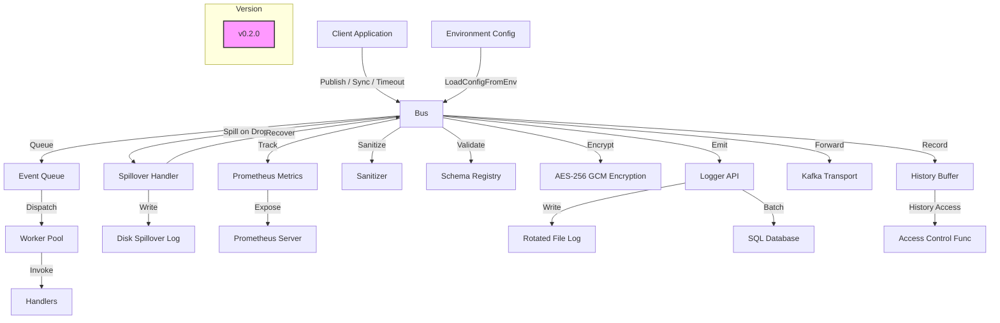

# Audit Package

The `audit` package is a robust, in-memory publish-subscribe bus for managing and processing audit events in Go applications. It is designed for high-throughput, low-latency event processing with features for resilience, observability, data integrity, and security.

## Table of Contents
- [Overview](#overview)
- [Features](#features)
- [Architecture](#architecture)
- [Installation](#installation)
- [Usage](#usage)
  - [Initializing the Audit Bus](#initializing-the-audit-bus)
  - [Subscribing to Events](#subscribing-to-events)
  - [Publishing Events](#publishing-events)
  - [Using Typed Events](#using-typed-events)
  - [Configuring Persistent Logging](#configuring-persistent-logging)
  - [Using the Logger API](#using-the-logger-api)
- [Event Types](#event-types)
- [Configuration Options](#configuration-options)
- [Security Features](#security-features)
- [Metrics and Observability](#metrics-and-observability)
- [External Transport](#external-transport)
- [Project Structure](#project-structure)
- [Mermaid Diagram](#mermaid-diagram)
- [License](#license)

## Overview
The `audit` package provides a flexible publish-subscribe system for audit events, built around the `Bus` struct. It supports synchronous and asynchronous event publishing, in-memory history with disk spillover, rate limiting, circuit breaking, and integration with external systems like Kafka. Version 1.0.0 enhances the package with generic typed events, schema validation for all event types, and a robust `Logger` API for structured logging. All APIs are concurrency-safe, using mutexes, atomics, channels, and worker pools to ensure reliability and orderly shutdown.

## Features
- **Event Publishing**: Supports `Publish` (async), `PublishSync` (sync), and `PublishWithTimeout` for controlled event delivery.
- **Event Subscription**: Register handlers for specific event types or all events (`EventAny`).
- **Event History**: In-memory ring buffer with deduplication by event ID, configurable via `HistoryCap` and `MaxMemoryMB`.
- **Disk Spillover**: Spills events to disk (JSONL format) when queue is full, rate limit is exceeded, or circuit is open, with automatic recovery.
- **Rate Limiting**: Configurable via `RateLimit` and `RateBurst` to throttle event publishing.
- **Circuit Breaker**: Protects against handler/transport failures, configurable with `CircuitTimeout` and `CircuitMaxFails`.
- **Metrics**: Integrates with Prometheus for tracking published events, dropped events, and handler latency.
- **External Transport**: Supports Kafka integration via `KafkaTransport` with retry/backoff logic.
- **Generic Typed Events**: Provides type-safe event payloads with `EventT[T]` and constructors like `NewAuthRegisterT`.
- **Logging**: `Logger` API for structured logging with file and database persistence.
- **Schema Validation**: Enforces payload consistency with predefined schemas for all event types.
- **Security**: Includes payload sanitization, AES-256 GCM encryption, and access control for history retrieval.

## Architecture
The `audit` package centers on the `Bus` struct, which manages event publishing, subscription, and processing. Key components include:
- **Event Queue**: Handles incoming events in async mode.
- **Worker Pool**: Processes events concurrently with configurable `WorkerCount`.
- **History Buffer**: Stores recent events with deduplication and memory limits.
- **Spillover Handler**: Persists events to disk during backpressure, with recovery via `RecoverSpillover`.
- **Circuit Breaker**: Monitors failures to prevent system overload.
- **Metrics**: Tracks performance via `BusMetrics` (Prometheus or no-op).
- **Transport**: Forwards events to external systems (e.g., Kafka).
- **Logger**: Provides a high-level API for structured logging.
- **Schema Registry**: Validates event payloads against predefined schemas.

## Installation
To use the `audit` package, ensure Go is installed, then import the package:

    go get github.com/dr4tinymous/audit

**Required dependencies:**
- `github.com/google/uuid`
- `go.opentelemetry.io/otel/trace`
- `golang.org/x/time/rate`
- `github.com/IBM/sarama` (for Kafka transport)
- `github.com/natefinch/lumberjack` (for file logging)
- `github.com/prometheus/client_golang/prometheus` (for metrics)

## Usage

Below are examples demonstrating key features of the audit package v1.0.0.

### Initializing the Audit Bus

Create a Bus with custom configuration:

    package main

    import (
        "log"
        "time"
        "github.com/dr4tinymous/audit"
        "github.com/prometheus/client_golang/prometheus"
    )

    func main() {
        bus, err := audit.NewBus(
            audit.WithHistoryCap(1000),
            audit.WithAsync(true),
            audit.WithBufferSize(500),
            audit.WithSpilloverDir("/var/log/audit"),
            audit.WithMaxMemoryMB(50),
            audit.WithRateLimit(1000, 200),
            audit.WithCircuitBreaker(30*time.Second, 5),
            audit.WithMetricsRegisterer(prometheus.DefaultRegisterer),
            audit.WithRecoverInterval(5*time.Second),
        )
        if err != nil {
            log.Fatalf("Failed to create audit bus: %v", err)
        }
        defer bus.Close()
    }

### Subscribing to Events

Register a handler for a specific event type:

    bus.Subscribe(audit.EventTypeAuthLogin, func(evt audit.Event) error {
        log.Printf("User login: %v at %v", evt.Payload(), evt.Time())
        return nil
    })

### Publishing Events

Publish a user login event:

    import (
        "context"
        "github.com/dr4tinymous/audit"
    )

    func main() {
        ctx := context.Background()
        bus := audit.DefaultBus()
        defer bus.Close()

        event := audit.NewAuthLogin(ctx, "auth-service", "user123")
        bus.Publish(event)
    }

### Using Typed Events

Use typed events for compile-time safety:

    event := audit.NewAuthRegisterT(ctx, "auth-service", "user123", "user@example.com")
    bus.Publish(event)
    payload := event.TypedPayload() // Type-safe: AuthRegisterPayload
    log.Printf("Registered user: %s, email: %s", payload.UserID, payload.Email)

### Configuring Persistent Logging

Set up file and database logging:

    import (
        "database/sql"
        "log"
        "time"
        "github.com/dr4tinymous/audit"
        _ "modernc.org/sqlite"
    )

    func main() {
        db, err := sql.Open("sqlite3", "./audit.db")
        if err != nil {
            log.Fatalf("Failed to open database: %v", err)
        }
        if err := audit.SetupDatabase(db); err != nil {
            log.Fatalf("Failed to setup audit database: %v", err)
        }

        bus := audit.DefaultBus()
        defer bus.Close()

        closers, err := audit.SetupLogging(bus, db,
            audit.WithFilePath("/var/log/app_audit.log"),
            audit.WithDBBatchSize(50),
            audit.WithFlushInterval(3*time.Second),
        )
        if err != nil {
            log.Fatalf("Failed to setup logging: %v", err)
        }
        for _, closer := range closers {
            defer closer()
        }
    }

### Using the Logger API

Use the Logger for structured logging:

    logger := audit.NewLogger(bus)
    ctx := context.Background()
    logger.Info(ctx, "app", "Service started", map[string]string{"version": "1.0.0"})
    logger.Error(ctx, "app", "DB connection failed", fmt.Errorf("connection refused"), nil)
    logger.AssertTrue(ctx, "app", "config loaded", config != nil)

## Event Types

The package defines the following event types with associated schemas and helper constructors:

- **HTTP Events**: `http_request_received`, `http_response_sent`, `http_route_not_found`, `http_method_not_allowed`
- **Authentication Events**: `auth_register`, `auth_login`, `auth_logout`, `auth_token_issued`, `auth_token_revoked`, `auth_credentials_checked`
- **Database Events**: `db_connected`, `db_init`, `db_error`, `db_query`, `db_exec`, `db_tx_started`, `db_tx_committed`, `db_tx_rolled_back`
- **Work Item Events**: `work_item_created`, `work_item_updated`, `work_item_deleted`, `work_item_assigned`, `work_item_unassigned`, `custom_field_set`
- **Comment & Attachment Events**: `comment_added`, `comment_deleted`, `attachment_added`, `attachment_removed`
- **User Events**: `user_created`, `user_updated`, `user_deleted`, `user_logged_in`, `user_logged_out`
- **Team Events**: `team_created`, `team_updated`, `team_deleted`, `team_member_added`, `team_member_removed`
- **Logging Events**: `log_info`, `log_warning`, `log_debug`, `log_error`, `log_fatal`, `log_assertion_failed`

Each event type has a registered schema for payload validation, accessible via `RegisterSchema`.

## Configuration Options

Configure the Bus using BusOption functions:

- `WithHistoryCap(n int)`: History buffer size (default: 10000)
- `WithBufferSize(n int)`: Async queue size (default: 1000)
- `WithWorkerCount(n int)`: Number of worker goroutines (default: 8)
- `WithAsync(async bool)`: Enable/disable async delivery (default: true)
- `WithSampleRate(rate float64)`: Event sampling rate (default: 1.0)
- `WithSpilloverDir(dir string)`: Directory for disk spillover (default: none)
- `WithMaxMemoryMB(mb int)`: Memory limit for history in MB (default: 100)
- `WithCircuitBreaker(timeout time.Duration, maxFails int)`: Circuit breaker settings (default: 30s, 5 fails)
- `WithRateLimit(rate, burst int)`: Events per second and burst size (default: 1000, 1000)
- `WithRecoverInterval(interval time.Duration)`: Interval for automatic spillover recovery (default: disabled)
- `WithMetrics(metrics BusMetrics)`: Custom metrics implementation
- `WithMetricsRegisterer(registerer prometheus.Registerer)`: Prometheus metrics
- `WithTransport(transport Transport)`: External transport (e.g., Kafka)
- `WithAccessControl(f AccessControlFunc)`: Custom history access control

Use `LoadConfigFromEnv` to load settings from environment variables (`AUDIT_HISTORY_CAP`, `AUDIT_BUFFER_SIZE`, etc.).

## Security Features

- **Payload Sanitization**: Redacts sensitive fields (e.g., email to `u****@example.com`, password to `****`) via `SanitizePayload`.
- **Event Encryption**: Supports AES-256 GCM encryption with `EncryptEvent` and `GenerateAESKey`.
- **Access Control**: Restricts history access via `AccessControlFunc` or default admin role check (`CheckHistoryAccess`).
- **Non-Latin Support**: Handles non-Latin characters in payloads.

## Metrics and Observability

The `PrometheusMetrics` implementation tracks:

- `audit_events_published_total`: Total published events by type.
- `audit_events_dropped_total`: Total dropped events by type.
- `audit_handler_latency_seconds`: Handler latency by event type.

Enable with `WithMetricsRegisterer(prometheus.DefaultRegisterer)`.

## External Transport

The `KafkaTransport` sends events to Kafka with retry logic. Example:

    kafka, err := audit.NewKafkaTransport([]string{"localhost:9092"}, "audit-topic", audit.WithKafkaRetries(5))
    if err != nil {
        log.Fatalf("Failed to create Kafka transport: %v", err)
    }
    bus, err := audit.NewBus(audit.WithTransport(kafka))

## Project Structure

    audit/
    ├── bus.go              # Core Bus implementation
    ├── config.go           # Configuration options
    ├── doc.go              # Package documentation
    ├── event.go            # Event types and helpers
    ├── log.go              # Logging and persistence
    ├── metrics.go          # Metrics implementation
    ├── schema.go           # Event schema validation
    ├── security.go         # Security features
    ├── transport.go        # External transport integration
    └── LICENSE.txt         # Unlicense

## Mermaid Diagram

## License

This project is licensed under the Unlicense, dedicating the software to the public domain. See LICENSE.txt for details.
